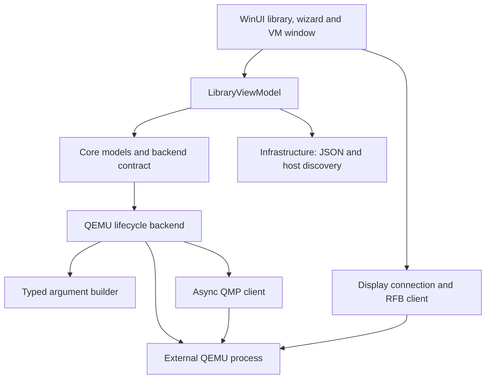
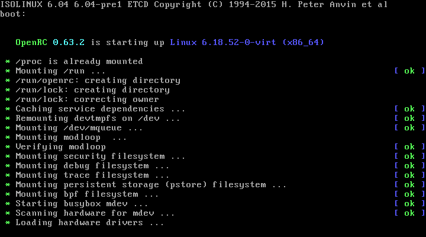
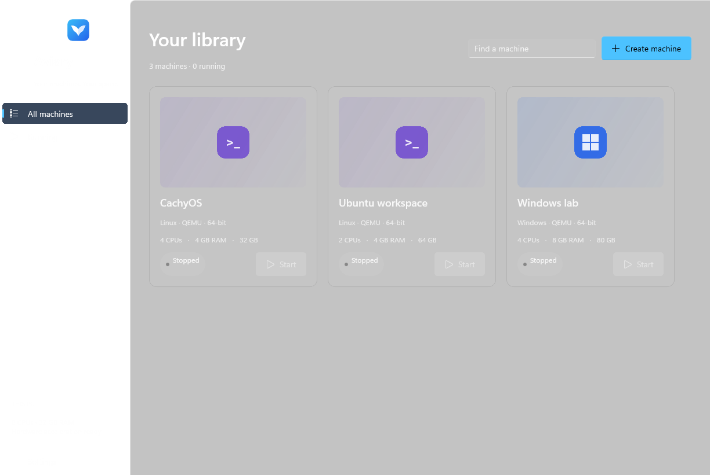
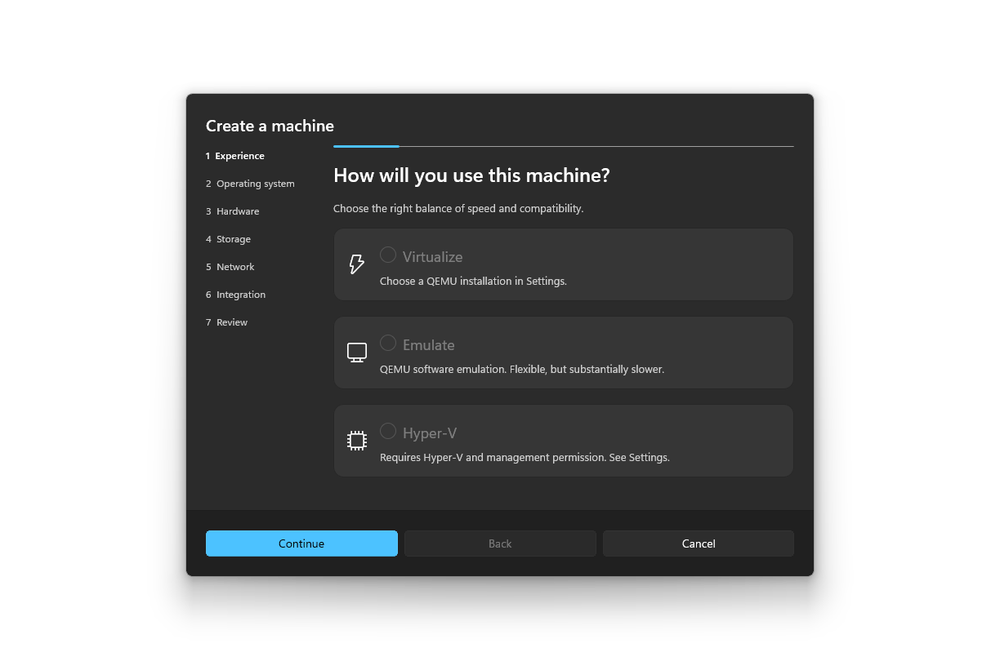

# Aviary

An experimental native Windows VM manager inspired by UTM and virt-manager. Built with C#, .NET 10, WinUI 3 and an external QEMU engine. Aviary is not affiliated with either project.

## Status

The first vertical slice is implemented: create an x86-64 Linux VM and disk, persist it in a library, start it, interact through an embedded display, control it through QMP, stop it and reopen it. The solution builds with warnings treated as errors. Unit and integration tests cover configuration, migration, command construction, architecture/acceleration choices, QMP and real QEMU lifecycle/display behavior.

Tested with QEMU 11.1.0 and Alpine Linux 3.24.2 using TCG. WHPX execution remains unverified in the restricted development environment. The library, machine details, settings, creation wizard and display window now share a native visual design. Rendered WinUI layouts and automated focus checks supplement the protocol tests; manual hardware and accessibility review remains release work.

## Build and run

Requirements: x64 Windows 10 1809 or newer (Windows 11 recommended), .NET 10 SDK and PowerShell. Windows App SDK and managed dependencies restore through NuGet. The unpackaged build includes the Windows App SDK runtime. Visual Studio is optional.

```powershell
.\setup-deps.ps1 -IncludeTestIso
.\build.ps1 -Test
.\start.ps1
```

The local development dependencies are in `.tools/`, excluded from Git. QEMU is in `.tools/qemu`; the test ISO is `.tools/downloads/alpine.iso`. `start.ps1` supplies the local QEMU path. Alternatively choose a QEMU folder in Settings or set `AVIARY_QEMU`.

Both app windows keep Windows' native title bar, caption buttons and Snap behavior, with light/dark theme tracking. The Aviary icon is embedded in the executable and used for window and shortcut icons. Its editable vector is `src/Aviary.App/Assets/Aviary.svg`; `packaging/windows/build-icon.ps1` regenerates the matching multi-resolution ICO and PNG.

The setup script uses pinned URLs and hashes, unpacks tools locally and leaves system PATH/features unchanged. In restricted development environments, use `build.ps1 -Isolated -Test` to keep profile/cache/temp files under `.build`. Isolated mode uses a separate application profile and should not be used for your normal library.

Install the [.NET 10 SDK](https://dotnet.microsoft.com/en-us/download/dotnet/10.0) if needed. [QEMU's download page](https://www.qemu.org/download/#windows) links to Windows builds. QEMU discovery checks the app-managed runtime directory, configured path, `AVIARY_QEMU`, Program Files, then PATH. It requires an emulator plus `qemu-img` and queries version and accelerators.

## Portable release

Run `./release-portable.ps1` to produce a self-contained Windows x64 app and ZIP under `.build/releases`. The package includes the .NET and Windows App SDK runtimes, QEMU, and its license files. Extract the complete folder to a writable location and launch `Aviary.App.exe`; no admin installation or system PATH changes are required.

The `portable.txt` marker keeps settings and new machines in `Data` beside the executable. Shut machines down before moving the folder. Managed disks and ISOs inside the portable folder use relative saved paths so they survive relocation; files outside that folder remain external. Keep `Data` when updating. Portable mode has its own library and does not automatically move your existing local machines.

Software emulation does not require WHPX. Hardware acceleration still needs the Windows feature and firmware virtualization; work PCs remain subject to IT application policies. The package is not code-signed. It bundles QEMU, whose license files are in `runtime/qemu`; see Contributing and licenses for its source.

## Install, update and uninstall

Run these in PowerShell. No admin rights are needed.

Install:

```powershell
irm https://raw.githubusercontent.com/benjweaver/aviary/main/packaging/windows/install.ps1 | iex
```

Update:

```powershell
irm https://raw.githubusercontent.com/benjweaver/aviary/main/packaging/windows/update.ps1 | iex
```

Uninstall (keeps your VMs, disks and settings):

```powershell
irm https://raw.githubusercontent.com/benjweaver/aviary/main/packaging/windows/uninstall.ps1 | iex
```

The installer downloads the latest GitHub release (`Aviary-vX.Y.Z-windows-x86_64.zip`) and checks it against the release's `SHA256SUMS` before extracting. To install a ZIP you already have, run `.\packaging\windows\install.ps1 -Archive <zip>` with `SHA256SUMS` beside it (or `-ChecksumFile`). Installation verifies the archive before extracting it, installs to `%LOCALAPPDATA%\Programs\Aviary`, and creates a Start menu shortcut. Installed copies use the normal `%LOCALAPPDATA%\Aviary` library; the portable marker is omitted. Updates require Aviary to be closed and remain manual. Uninstall removes only tracked program files and preserves settings, VMs, and unrecognized files. No PATH or automatic-start changes are made.

## First VM

1. Click **Create machine** and select virtualization when available, or software emulation.
2. Choose Linux, a name and an x86-64 installer ISO.
3. Allocate CPU/RAM; the wizard reserves one host CPU and at least 25% of RAM.
4. Choose QCOW2 (default) or RAW disk capacity and NAT networking.
5. Review the configuration and unavailable sharing features; create and start the VM.
6. Click the display to type. Clicking the toolbar or switching windows releases held guest keys automatically. Ctrl+Alt+G optionally returns focus to the toolbar; Right Ctrl goes to the guest. The mouse moves freely, with one guest cursor. The toolbar provides fullscreen and a menu for Ctrl+Alt+Del.
7. Install onto the virtual disk. Shut down requests ACPI shutdown; the guest must support it. Force off requires confirmation.
8. Edit to clear the installer ISO after installation if desired. Disk is first in persistent boot order; CD-ROM is first on the initial boot of each QEMU process.

Closing the app with running QEMU VMs asks before powering them off. Windows job ownership prevents orphan QEMU processes if the app crashes; a crash can therefore lose unsaved guest work.

## Adaptive display

New Linux machines enable adaptive display by default. For an existing stopped machine, choose **Edit configuration → Adaptive display**, save, then start it. Changing this setting makes a timestamped backup of `config.json` and selects a virtio display adapter. Existing configurations keep their previous adapter until you opt in.

With **Auto resolution** enabled in the VM window, Aviary asks the guest desktop to follow the window size. This requires a working guest virtio display driver and desktop support; firmware screens and text consoles may keep a fixed resolution. The footer shows the resolution actually received. **Fit to window** and **Actual size** remain available independently, and rejected resize requests fall back to scaling.

## Virtualization and emulation

### Native Hyper-V

The creation wizard offers **Hyper-V** alongside QEMU virtualization and emulation. This is a native Windows backend, separate from QEMU's WHPX accelerator. Availability is checked through the Hyper-V PowerShell module and management service. Enable Hyper-V Platform and Management Tools on a supported Windows edition; your account also needs Hyper-V management permission. Aviary does not elevate itself, enable Windows features, or create host virtual switches.

New Hyper-V machines use Generation 2 UEFI and dynamically expanding VHDX disks. Windows guests get Secure Boot and a local virtual TPM; Linux guests use Secure Boot off for compatibility. Pick an existing virtual switch, such as Default Switch, or leave networking disconnected. Choose CPU, memory, and disk capacity appropriate for the guest OS.

Start, shutdown, force-off, pause, resume and reset route through Windows. **Open** launches VMConnect. Enhanced Session resizing and device sharing depend on host and guest configuration; Aviary's embedded QEMU display does not apply. See Microsoft's [VMConnect guidance](https://learn.microsoft.com/en-us/windows-server/virtualization/hyper-v/enhanced-session-mode) and [New-VM reference](https://learn.microsoft.com/en-us/powershell/module/hyper-v/new-vm).

Hyper-V guests keep running when Aviary closes, and their current status is refreshed when it reopens. Commands target the saved Hyper-V ID and verify an Aviary ownership marker. Existing QEMU machines remain QEMU; disk conversion and adoption of existing Hyper-V registrations are not implemented. Removing a library entry leaves its Windows registration and disk in place. Moving native machines requires Hyper-V export/import, even when Aviary itself is portable.

Hyper-V command handling, configuration persistence, state mapping and ownership checks are tested with a simulated host and real PowerShell parsing. This development environment does not expose Hyper-V management, so native guest creation and boot remain unverified on enabled hardware.

WHPX uses the host hypervisor for compatible x86 guests on x64 Windows. TCG emulates CPUs in software and is substantially slower. Aviary never silently changes a VM's saved acceleration choice.

To enable WHPX, enable CPU virtualization in firmware if necessary, enable **Windows Hypervisor Platform** under **Turn Windows features on or off**, and restart Windows. That optional feature change may need administrator approval; Aviary itself does not. See [QEMU WHPX documentation](https://www.qemu.org/docs/master/system/whpx.html).

The wizard creates x86-64 guests; QEMU also supports x86 command generation. ARM64 and RISC-V are recognized by discovery and the configuration enum, but launch is explicitly unavailable pending machine/firmware support. The QEMU profile uses PC, BIOS, IDE, USB tablet and e1000 NAT; its UEFI/TPM support is not implemented. Native Hyper-V uses Generation 2 instead.

## Architecture



| Project | Responsibility |
| --- | --- |
| Aviary.App | WinUI views, library view model, wizard, settings, diagnostics and display rendering/input |
| Aviary.Core | Typed configuration, runtime state and backend/display contracts |
| Aviary.Infrastructure | Atomic JSON, migration, host/QEMU discovery, helper processes and Windows job ownership |
| Aviary.Qemu | Arguments, disk creation, lifecycle, logging and RFB transport |
| Aviary.Qmp | Async handshake, IDs, responses, events, cancellation and disconnects |
| Aviary.Tests | Unit/protocol tests and opt-in real-engine coverage |

QEMU command construction stays outside view models. Processes use ArgumentList without a shell. Disk paths use JSON blockdev definitions to preserve spaces and commas. Runtime status belongs to the backend.

SPICE client packaging/interoperability would broaden this milestone. The integrated display uses loopback RFB/VNC with raw rectangles, RichCursor, ExtendedDesktopSize, scaling, absolute pointer input and basic US keyboard mapping. Focus changes release tracked keys and buttons; input writes are serialized. IDisplayConnection separates endpoint ownership from the window; transport/rendering should be further generalized before adding another protocol. Branding is centralized in Aviary.Core/Models.cs.

## Storage and diagnostics

Settings are in `%LOCALAPPDATA%/Aviary/settings.json`. The default library is `%LOCALAPPDATA%/Aviary/Machines`.

```text
<vm-guid>/
  config.json
  disks/system.qcow2
  nvram/
  logs/stdout.jsonl
  logs/stderr.jsonl
```

Schema version 1 uses typed JSON. Missing/version-0 configurations migrate in memory; future versions are rejected. Saves use unique sibling temporary files and same-volume replacement. Malformed configurations are reported without discarding other library entries. Diagnostics shows a command preview and recent timestamped QEMU stderr.

Remove only renames config.json to config.removed.json; disks remain. Restoring that filename restores the entry. Permanent deletion is unavailable. No user disk is implicitly deleted. Integration tests clean up only their newly created temporary fixtures.

## Testing

```powershell
$env:AVIARY_QEMU = "$PWD\.tools\qemu"
$env:AVIARY_TEST_ISO = "$PWD\.tools\downloads\alpine.iso"
.\build.ps1 -Test
```

Real-engine coverage is explicitly skipped when AVIARY_QEMU is absent. It creates a disk, starts TCG, checks RFB frames, sends input, exercises pause/resume/reset/powerdown/force-off, reloads JSON and starts again. It does not install an OS. ACPI command success does not prove guest shutdown; force-off cleans up nonresponding guests.

The automated tests also cover keyboard focus and release, pointer coordinate mapping, cursor masks, resize messages and a real QEMU adaptive-display request. For debug UI verification, set `AVIARY_UI_PREVIEW` to an output directory before launching the app. It renders synthetic library fixtures without loading your library. With `AVIARY_QEMU` set, it also opens a disposable TCG guest, checks focus transfer and renders the display window. Optional `AVIARY_TEST_ISO` selects its boot image.

## Screenshots

Actual Alpine guest framebuffer captured through Aviary's RFB client:



Actual WinUI rendering with synthetic library entries used for layout review:





## Current limitations

- Import, clone, snapshots, permanent deletion, hotplug and disk resizing are not implemented. The backend contract exposes working operations only.
- QEMU UEFI/TPM, ARM64/RISC-V profiles, guest tools, sharing, clipboard, audio, USB passthrough are unavailable. Experimental Linux OpenGL graphics uses virtio-vga-gl with EGL and the embedded RFB display; guest 3D performance is not yet validated. QEMU Windows guest 3D is not implemented. Hyper-V GPU-P setup is not included in release builds (see below). Hyper-V provides UEFI/TPM and uses VMConnect for guest integration.
- Display uses uncompressed RFB and basic US keyboard mapping. Windows-reserved shortcuts stay with the host; no exclusive keyboard hook.
- QMP/VNC bind to loopback without authentication. Multi-user deployment needs authenticated endpoints or named pipes and stronger endpoint ownership.
- No external VM adoption. QEMU guests cannot survive application exit. Native Hyper-V guests are managed by Windows and do survive it.
- Port allocation has a small bind race; failures become startup errors. Log rotation and disk-space preflight remain work.
- Appearance follows Windows. Updates and arbitrary advanced QEMU arguments are unavailable.
- Packaging, accessibility/localization review, UI automation and WHPX hardware tests remain release work.

Next milestones: harden lifecycle and input UX, verify WHPX on supported hardware, add firmware profiles, then import/clone and explicitly confirmed permanent deletion with storage ownership rules.

## Contributing and licenses

Build the complete solution and run tests for each change. Keep configuration versioned, flags outside view models and I/O asynchronous. Preserve valid configurations and never delete user disks as implicit cleanup. Include manual Windows UI checks for UI changes.

Aviary is licensed GPL-3.0-or-later; see [LICENSE](LICENSE). Release packages bundle unmodified QEMU 11.1.0 (qemu-w64-setup-20260811 by Stefan Weil, git e470268ff4). Source: https://gitlab.com/qemu-project/qemu/-/tree/e470268ff4 and https://www.qemu.org/download/#source. QEMU is GPL-2.0 licensed and its COPYING files ship in `runtime/qemu`. Windows App SDK and CommunityToolkit.Mvvm use MIT licenses. Guest images retain their own licenses.


## Graphics, network and fullscreen

With a QEMU machine stopped, open Edit configuration. VirtIO network selects the paravirtualized adapter while preserving shared NAT. Modern Linux includes its driver; install NetKVM in Windows before switching. Existing machines retain their previous adapter. New Linux machines default to VirtIO networking.

Experimental 3D graphics is opt-in for Linux and requires adaptive display, guest Mesa/virtio support and a working host OpenGL driver. It uses `virtio-vga-gl` and `egl-headless`; there is no silent fallback to software. If startup or guest rendering fails, stop the machine and turn 3D off. Startup and framebuffer tests do not prove guest 3D acceleration or performance. Hyper-V continues using its synthetic network adapter and VMConnect; GPU sharing is not configured by release builds.

Fullscreen hides the title bar, toolbar and status bar. Move to the top edge for exit controls, or press Ctrl+Alt+Enter to toggle fullscreen. Ctrl+Alt+G releases guest focus to the controls. Guest automatic resolution continues to follow the usable screen size when supported by its driver.

### Cursor rendering

The guest surface uses an explicit transparent WinUI InputCursor, created through the Windows App SDK cursor interop API. A null ProtectedCursor inherits cursor behavior and must not be used to hide the host pointer. RFB cursor images remain rendered at the mapped guest position; leaving the guest or deactivating its window restores the host pointer. The debug UI harness verifies transparent/normal cursor selection alongside focus and fullscreen transitions.

### Windows guest graphics

The Linux VirGL option is not offered as Windows 3D acceleration. The standard VirtIO Windows display-only driver does not provide it; the upstream 3D work remains separate: https://github.com/virtio-win/kvm-guest-drivers-windows/pull/943 . The experimental driver at https://github.com/AlanoSong/virtio-gpu-win requires test-signing in the guest. Aviary does not install that driver or alter signature enforcement. Windows 3D integration needs its own validated guest-driver and host graphics path.

## Guest setup and access

New Windows machines default to local-account setup. Enter a local username and password; Aviary attaches a setup ISO with an autounattend.xml answer file. It hides Microsoft account OOBE and creates the requested local administrator without automating partitioning or activation. This is fresh-install provisioning, not a change to existing guest accounts. The password is not saved in config.json, but is present on the protected setup ISO. After installation, shut down and choose **Eject and remove setup CD**. Guest Windows setup itself may cache setup data.

SSH preparation is opt-in at creation or through **SSH access** on a stopped machine. It generates a per-machine Ed25519 key and puts only its public key on the setup ISO. Run the included guest script once as administrator/root. It installs OpenSSH and a standard `aviary-agent` account with public-key-only login. QEMU forwarding binds to host loopback; Hyper-V uses the guest IP (enter it in the dialog). The copied connection command works in PowerShell for terminals and coding agents. Verify the guest fingerprint on first connection. A prepared profile is not proof of a working guest service. Disabling a Hyper-V profile does not revoke its guest key.

### Experimental Hyper-V GPU sharing

Not included in release builds. It is unverified in a real guest, so the button and helper are compiled out by default. To try it, build with `dotnet build -p:EnableGpuPartition=true` (or pass the same property to publish). The helper source is `packaging/windows/setup-hyperv-gpu.ps1`; its tests run in every build.

For an installed Windows Hyper-V guest, open **GPU sharing (experimental)**. The interactive elevated helper verifies Aviary ownership, lets you choose among partitionable GPUs, and requests a guest administrator password through PowerShell Direct. It requires matching host/guest Windows build numbers, copies the matching host GPU driver files, requests graceful shutdown, records original VM memory settings in protected `%ProgramData%\Aviary\GpuRecovery`, and attaches a GPU partition using Windows defaults. It never changes the host-wide partition count, disables the basic display, or force-powers off the guest.

Undo removes the assignment and restores VM settings; copied guest drivers remain. Repeat setup after host driver updates. The helper checks recovery ownership and rolls back hardware settings if assignment/start fails while the VM is off. Driver copying and actual 3D acceleration still require testing inside a real installed guest. Check Device Manager, dxdiag and a 3D application; VMConnect is not a GPU streaming solution.

Desktop Windows / consumer GPU-P is outside Microsoft's supported configurations: [Microsoft support guidance](https://learn.microsoft.com/en-us/troubleshoot/windows-server/virtualization/troubleshoot-hyper-v-gpu-assignment-partitioning-passthrough-issues). GPU enumeration or a running VM is not confirmation of working acceleration.
